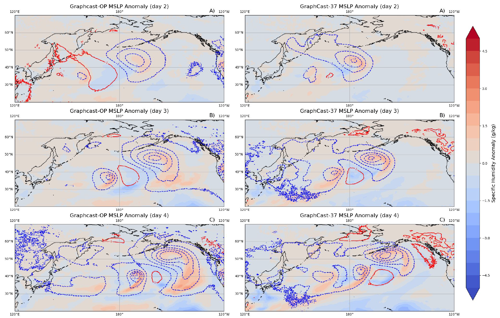
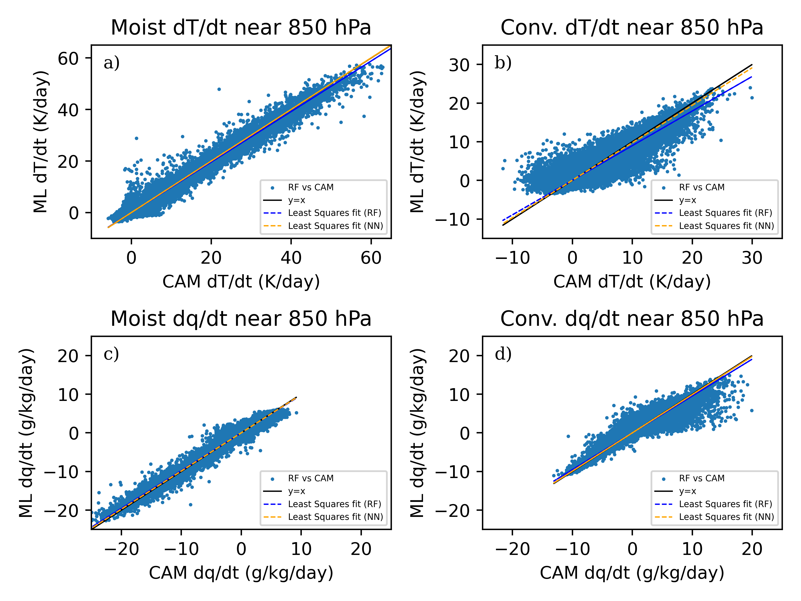
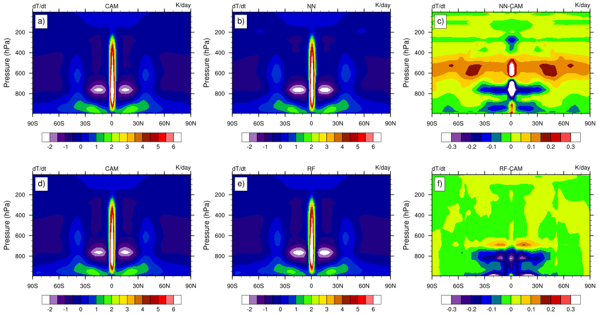

Project 1: Dynamical Evaluation Framework for AI Weather Forecasting

As AI-driven weather forecasting systems like Google's GraphCast and NVIDIA's FourCastNet move toward operational use, rigorous evaluation of their physical consistency becomes increasingly critical. This project extended idealized dynamical test cases — originally developed for traditional numerical weather prediction models — to GraphCast's 37-level configuration, providing one of the first systematic investigations into how vertical resolution shapes the dynamics learned by these systems. 
 
By applying perturbation experiments such as tropical heating anomalies and extratropical cyclone seeds, we assessed whether these models reproduce physically expected atmospheric responses. GraphCast-37 showed substantially improved wave responses compared to the operational 13-level version, while also revealing artifacts and limitations that standard forecast verification metrics would not detect. This work offers researchers new diagnostic tools to evaluate the physical interpretability and trustworthiness of next-generation AI forecasting systems.

Project 2: ML Emulators for Physical Parameterizations in CAM6

Physical parameterizations represent some of the most computationally expensive and uncertain components of climate models. This project evaluated the feasibility of Random Forest (RF) and Neural Network (NN) emulators as drop-in replacements for these processes within NCAR's Community Atmosphere Model (CAM6). Using a systematic hierarchy of model configurations, from a simple dry atmosphere to a fully moist convective case, we demonstrated that RF emulators achieve strong predictive skill in simplified settings, but that skill degrades systematically as model complexity increases.

The work also showed that incorporating domain knowledge through targeted feature selection, such as the inclusion of relative humidity as a predictor, can meaningfully improve emulator performance. These findings were published in the Journal of Advances in Modeling Earth Systems (2023) and established important practical benchmarks for the use of tree-based ML methods in climate modeling.

Project 3: Online Coupling of ML Emulators into CAM6

Taking ML emulators from offline evaluation into live climate simulations introduces a new class of scientific and engineering challenges. This project embedded both RF and NN emulators directly into CAM6's Fortran infrastructure, requiring the development of a Python-Fortran interface capable of running ML inference in real time alongside the model's dynamical core. 

Online deployment revealed critical barriers not visible in offline testing, including neural network instability in convectively active regions, memory constraints in RF inference at scale, and interface incompatibilities between modern ML frameworks and CAM6's highly optimized Fortran codebase. These findings directly inform the practical boundaries of ML-climate model coupling and highlight the importance of testing emulators in the dynamical environment they are meant to replace.

Project 4: Numerical Methods for Biomolecular Solvation (M.S. Research)

During his M.S. studies at California State University, Northridge, Garrett developed and implemented a recursive multi-grid solver to optimize the computational efficiency of biomolecular solvation calculations within the 3D Reference Interaction Site Model (3D-RISM) framework. This work established his foundation in scientific computing, numerical methods, and Fortran and Python development — skills that would directly carry forward into his doctoral research in atmospheric modeling.
